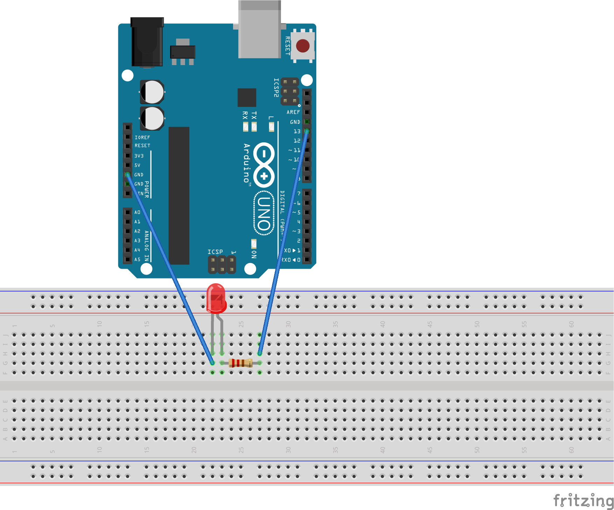

# Проект "Маячок"

В этом проекте мы просто мигаем светодиодом.

## Список деталей для проекта

- 1 плата [Arduino Uno R3](../../articles/ArduinoComponents.md#arduino-uno-r3)
- 1 беспаечная [макетная плата](../../articles/ArduinoComponents.md#макетная-плата---breadboard-half)
- 1 [светодиод](../../articles/ArduinoComponents.md#светодиоды-5-мм---5-mm-led)
- 1 [резистор номиналом 220 Ом](../../articles/ArduinoComponents.md#резистор-220-ом---resistor-220-ω)
- 2 [провода "папа-папа"](../../articles/ArduinoComponents.md#провод-папа-папа---wire-dad-dad)

## Схема на макетной плате



[Схема для приложения Fritzing](Blink.fzz)

## Код для Arduino

[Blink.ino](Blink.ino):

```c
void setup()
{
  pinMode(13, OUTPUT);
}

void loop()
{
  digitalWrite(13, HIGH);
  delay(100);
  digitalWrite(13, LOW);
  delay(900);
}
```

## Результат

