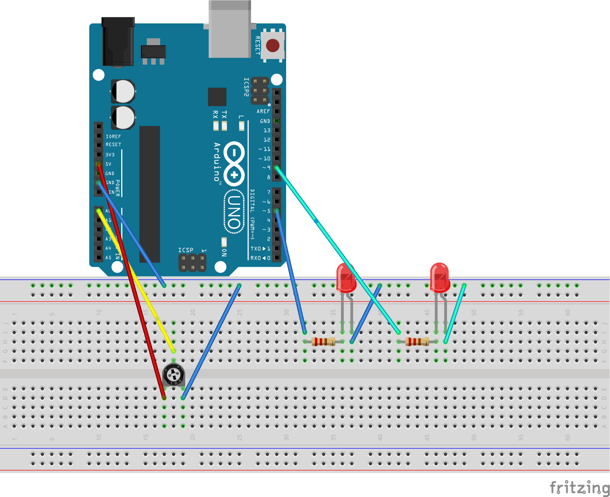

# Проект "Светильник с управляемой яркостью"

В этом проекте мы меняем яркость светодиода, вращая ручку переменного резистора. Один светодиод будет регулироваться потенциометром, а второй будет иметь яркость, равную 1/8 от яркости первого светодиода.

## Список деталей для проекта

- 1 плата [Arduino Uno R3](../../articles/ArduinoComponents.md#arduino-uno-r3)
- 1 беспаечная [макетная плата](../../articles/ArduinoComponents.md#макетная-плата---breadboard-half)
- 2 [светодиода](../../articles/ArduinoComponents.md#светодиоды-5-мм---5-mm-led)
- 2 [резистора номиналом 220 Ом](../../articles/ArduinoComponents.md#резистор-220-ом---resistor-220-ω)
- 8 [проводов "папа-папа"](../../articles/ArduinoComponents.md#провод-папа-папа---wire-dad-dad)
- 1 [потенциометер](../../articles/ArduinoComponents.md#потенциометер---potentiometer)

## Схема на макетной плате



[Схема для приложения Fritzing](PotLight.fzz)

## Код для Arduino

[PotLight.ino](PotLight.ino):

```c
#define LED_PIN_1 9
#define LED_PIN_2 5
#define POT_PIN A0

void setup()
{
  pinMode(LED_PIN_1, OUTPUT);
  pinMode(LED_PIN_2, OUTPUT);
  pinMode(POT_PIN, INPUT);
}

void loop()
{
  int rotation, brightness_pin_1, brightness_pin_2;

  rotation = analogRead(POT_PIN);
  brightness_pin_1 = rotation / 4;
  brightness_pin_2 = rotation / 32;

  analogWrite(LED_PIN_1, brightness_pin_1);
  analogWrite(LED_PIN_2, brightness_pin_2);
}
```

## Результат

