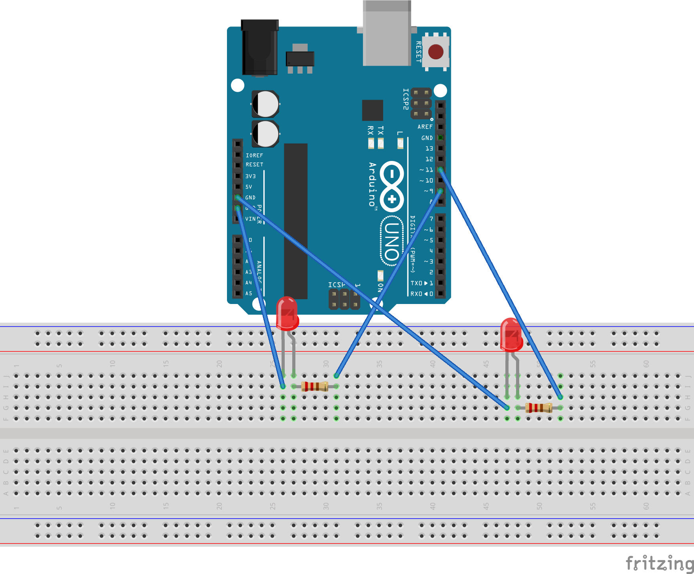

# Проект "Маячок с нарастающей яркостью"

В этом проекте мы задаем различные уровни яркости светодиодов: первый выключен, а второй горит максимально ярко; затем первый начинает загораться до максимальной яркости, а второй постепенно потухать, а потом выключается.

## Список деталей для проекта

- 1 плата [Arduino Uno R3](../../articles/ArduinoComponents.md#arduino-uno-r3)
- 1 беспаечная [макетная плата](../../articles/ArduinoComponents.md#макетная-плата---breadboard-half)
- 2 [светодиода](../../articles/ArduinoComponents.md#светодиоды-5-мм---5-mm-led)
- 2 [резистора номиналом 220 Ом](../../articles/ArduinoComponents.md#резистор-220-ом---resistor-220-ω)
- 4 [провода "папа-папа"](../../articles/ArduinoComponents.md#провод-папа-папа---wire-dad-dad)

## Схема на макетной плате

> Только пины, отмеченные тильдой (~) поддерживают ШИМ сигнал



[Схема для приложения Fritzing](PulseLight.fzz)

## Код для Arduino

[PulseLight.ino](PulseLight.ino):

```c
#define LED_PIN_1 9
#define LED_PIN_2 11

#define NO_LIGHT 0
#define START_LIGHT 85
#define MID_LIGHT 170
#define MAX_LIGHT 255

int led_max = LED_PIN_1;
int led_min = LED_PIN_2;

void setup()
{
  pinMode(LED_PIN_1, OUTPUT);
  pinMode(LED_PIN_2, OUTPUT);

  analogWrite(led_max, MAX_LIGHT);
  analogWrite(led_min, NO_LIGHT);
}

void loop()
{
  analogWrite(led_max, MAX_LIGHT);
  analogWrite(led_min, NO_LIGHT);
  delay(250);

  analogWrite(led_max, MID_LIGHT);
  analogWrite(led_min, START_LIGHT);
  delay(250);

  analogWrite(led_max, START_LIGHT);
  analogWrite(led_min, MID_LIGHT);
  delay(250);

  analogWrite(led_max, NO_LIGHT);
  analogWrite(led_min, MAX_LIGHT);
  delay(250);

  if (led_max == LED_PIN_1)
  {
    led_max = LED_PIN_2;
    led_min = LED_PIN_1;
  }
  else
  {
    led_max = LED_PIN_1;
    led_min = LED_PIN_2;
  }
}
```

## Результат

