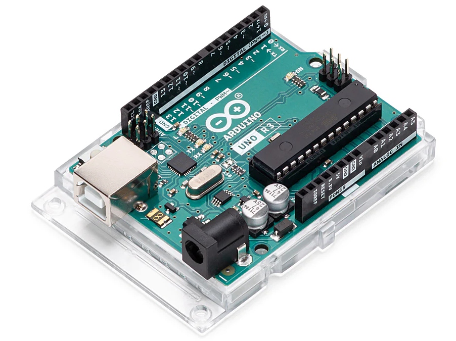
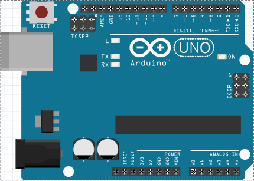

<h1>Список компонентов для Arduino</h1>

<h2>Содержание</h2>

- [Микроконтроллеры - Microcontrollers](#микроконтроллеры---microcontrollers)
  - [Arduino Uno R3](#arduino-uno-r3)
- [Макетные платы - Breadboards](#макетные-платы---breadboards)
  - [Макетная плата - Breadboard Half](#макетная-плата---breadboard-half)
- [Светодиоды - LED](#светодиоды---led)
  - [Светодиоды 5 мм - 5 mm LED](#светодиоды-5-мм---5-mm-led)
- [Резисторы](#резисторы)
  - [Резистор 220 Ом - Resistor 220 Ω](#резистор-220-ом---resistor-220-ω)
- [Провода и кабели](#провода-и-кабели)
  - [Провод "папа-папа" - wire "dad-dad"](#провод-папа-папа---wire-dad-dad)
- [Сенсоры](#сенсоры)
  - [Потенциометер - Potentiometer](#потенциометер---potentiometer)

## Микроконтроллеры - Microcontrollers
### Arduino Uno R3

Вид реального устройства:

Вид на схеме:

Характеристики:

| Характеристика                                                                               | Значение                                                                                               |
| -------------------------------------------------------------------------------------------- | ------------------------------------------------------------------------------------------------------ |
| Микроконтроллер                                                                              | ATmega328P                                                                                             |
| Рабочее напряжение                                                                           | 5 В                                                                                                    |
| Входное напряжение (рекомендуется)                                                           | 7-12 В                                                                                                 |
| Входное напряжение (предел)                                                                  | 6-20 В                                                                                                 |
| Цифровые контакты ввода/вывода                                                               | 14 (из которых 6 обеспечивают выход ШИМ - Широтно-импульсная модуляция) / PWM - Pulse-Width Modulation |
| Контакты цифрового ввода/вывода ШИМ                                                          | 6                                                                                                      |
| Аналоговые входные контакты                                                                  | 6                                                                                                      |
| Постоянный ток на контакт ввода-вывода                                                       | 20 мА                                                                                                  |
| Постоянный ток для контакта 3,3 В                                                            | 50 мА                                                                                                  |
| Флеш память                                                                                  | 32 КБ (ATmega328P) из которых 0,5 КБ используется загрузчиком                                          |
| SRAM (статичная память с произвольной выборкой)                                              | 2 КБ (ATmega328P)                                                                                      |
| EEPROM (долгосрочная память)                                                                 | 1 КБ (ATmega328P)                                                                                      |
| Тактовая частота                                                                             | 16 МГц                                                                                                 |
| LED_BUILTIN (константа, которая заранее определена в языке программирования модулей Arduino) | 13                                                                                                     |
| Длина                                                                                        | 68.6 мм                                                                                                |
| Ширина                                                                                       | 53.4 мм                                                                                                |
| Вес                                                                                          | 25 г                                                                                                   |

Схема распиновки:

## Макетные платы - Breadboards
### Макетная плата - Breadboard Half

Вид реальной макетной платы:

Вид на схеме:

## Светодиоды - LED
### Светодиоды 5 мм - 5 mm LED

Вид реального светодиода:

Вид на схеме:

Характеристики:

|Цвет|Макс. прямое напряжение (В)|Сила тока (мА)|
|---|---|---|
|Красный|2.3|20|
|Желтый|2.5|20|
|Зеленый|2.5|20|
|Синий|3.8|20|
|Белый|3.8|20|

## Резисторы
### Резистор 220 Ом - Resistor 220 Ω

Вид реального резистора:

Вид на схеме:

## Провода и кабели
### Провод "папа-папа" - wire "dad-dad"

Вид реального провода:

Вид провода на схеме:

## Сенсоры
### Потенциометер - Potentiometer

Вид реального потенциометра:

Вид потенциометра на схеме:

